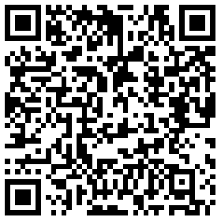

# TYDownloadBar

> A Vue.js project
> 1. 基于vue封装的引导用户由web进入App、下载App(以微信为例)，包含二维码引导的方式
> 2. 使用前先引入mint-ui，其中弹窗需要用到mint-ui的popup 

## Demo地址

[https://thomasty.github.io/TYDownloadBar/dist/#/](https://thomasty.github.io/TYDownloadBar/dist/#/)

## 另附DownloadMobile组件
这个组件是用作通过二维码引导用户下载，在微信中使用DownloadMobile组件可以避开应用宝下载App。
扫描这个二维码，可以去到DownloadMobile组件




## Build Setup

``` bash
# install dependencies
npm install

# serve with hot reload at localhost:8080
npm run dev

# build for production with minification
npm run build

# build for production and view the bundle analyzer report
npm run build --report

# run unit tests
npm run unit

# run e2e tests
npm run e2e

# run all tests
npm test
```

For a detailed explanation on how things work, check out the [guide](http://vuejs-templates.github.io/webpack/) and [docs for vue-loader](http://vuejs.github.io/vue-loader).
